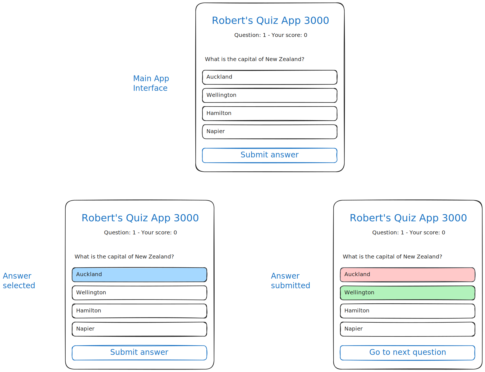

# Project: Build a Quiz App with HTML and JavaScript

In this project, you'll create a simple multiple-choice quiz app using HTML and
JavaScript. You'll practice structuring a web project and adding interactivity
with JavaScript.

This project is designed to be completed _within one day_.

For every step:

- Read the brief and acceptance criteria (and hints if you want). If you're
  unsure what to do, get help immediately.
- When you've fulfilled the acceptance criteria, make a commit and push it to
  GitHub. This means **one commit per step**.
- In the associated GitHub project board, move your card.

Here's a sketch of what you'll build:

---

## Step 1: Fork the Starter Repository

**Brief:**

Fork the provided GitHub repository to your own account to begin the project.
Change the `README.md` in your fork, remove all the instructions, and instead
just give it a headline with the name for your quiz app. A headline in Markdown
starts with a hashtag and a space `# `, so for example
`# Robert's Quiz App 3000`.

**Acceptance Criteria:**

- ✅ The repository is forked to your GitHub account.
- ✅ You have cloned the forked repository to your local machine.
- ✅ You have replaced the `README.md` with your own README.

Don't forget to commit, push, and move your project card.

---

## Step 2: Set Up the Project Structure

**Brief:**

Create the basic file structure for your project.

**Acceptance Criteria:**

- ✅ Your repository contains `index.html`, `style.css`, `script.js` files.
- ✅ All files are correctly linked:
  - `script.js` is linked in `index.html` before the closing `</body>` tag
  - `style.css` is linked in `index.html` inside the `<head>` tag

---

## Step 3: Create the Basic HTML Structure

**Brief:**

Set up the foundational HTML structure in `index.html`.

**Acceptance Criteria:**

- ✅ `index.html` includes the `<!DOCTYPE html>` declaration.
- ✅ The `<html>`, `<head>`, and `<body>` tags are correctly set up.
- ✅ A `<title>` tag is added with the your app title, e.g. "Quiz App 3000".

---

## Step 4: Design the Quiz Interface

**Brief:**

Create the main interface elements: a question area and answer choices.

Have a look at the interface design linked above

Don't worry about getting the actual questions and answers in there yet, just
work with a placeholder (for example, the question/answers you see above).

**Acceptance Criteria:**

- ✅ An element (e.g., `
`) is added to display the quiz question.
- ✅ Four elements added (e.g., using more `
` tags styled to have a border)
  to display the possible answers
- ✅ A "Submit" button is added to submit the answer. This can be a `
` or a
  `<button>` tag.

---

## Step 5: Display the First Question

**Brief:**

Use JavaScript to display the first question and its answer choices on the page.
The questions and answers have already been added to your `script.js` file as an
array in the variable `questions`.

**Acceptance Criteria:**

- ✅ The question text is displayed in the designated question area.
- ✅ All four answer choices are displayed correctly.
- ✅ Only one question is displayed at a time.

---

## Step 6: Handle User Answer Submission

**Brief:**

When the user clicks on an answer, they should get feedback: the answer they
clicked on should adopt a different background color.

When the user clicks "Submit answer" without selecting an answer, they should be
alerted to that.

**Acceptance Criteria:**

- ✅ When the user clicks on an answer, it should highlight. When the user
  clicks on another answer, that answer should highlight instead.
- **✅ If no answer is selected, an alert prompts the user to choose an
  option.**

  
Hints

  - Get a reference to all four answer buttons to work with them later using e.g. `let button = document.getElementById(...)`
  - Use an `onClick` handler for every answer button to call a function, e.g. "selectFirstAnswer"
  - Use an `onClick` handler for the submit button to call a function, e.g. "submitAnswer"
  - Write a function `selectFirstAnswer` that sets the variable `selectedAnswer` and sets the `background-color` of _all_ answer buttons.
  - You can use the JavaScript function `alert()` to alert the user if they press "Submit answer" without having selected an answer beforehand

---

## Step 7: Show Feedback for the Answer

**Brief:**

When the user clicks "Submit answer" after selecting an answer, provide
immediate feedback to them.

**Acceptance Criteria:**

- ✅ The correct answer is highlighted in green.
- ✅ If the user selected a different answer, that is highlighted in red.
- ✅ The submit button now shows a different caption: "Go to next question"

  
Hints

  - Get a reference to the answer button to work with, using the same method as above.
  - You can change the answer button title with `.innerText = …`

---

## Step 8: Move to the Next Question

**Brief:**

Implement functionality to proceed to the next question after feedback.

**Acceptance Criteria:**

- ✅ After pressing "Go to next question", the app moves to the next question.
- ✅ The question and answer choices are updated with the next set from your
  `questions` array.
- ✅ The button caption changes back to "Submit answer".

  
Hints

  - Your can define a variable named `didSubmitAnswer` to help you figure out whether your "submitAnswer" function should go to the next question or not

---

## Step 9: Keep Track of the Score

**Brief:**

Maintain a score to keep track of the user's correct answers.

**Acceptance Criteria:**

- ✅ A variable is initialized to keep track of the score, starts at 0.
- ✅ The score increments by one for each correct answer.
- ✅ The score is shown below the title.

---

## Step 10: Display the Final Result

**Brief:**

Show the user's total score and a summary at the end of the quiz.

**Acceptance Criteria:**

- ✅ After the last question, the final score is displayed.
- ✅ A message summarizes the user's performance (e.g., "You scored 4 out of
  5").
- ✅ An option to restart the quiz is provided.

---

## Step 11: Implement Quiz Restart Functionality

**Brief:**

Allow the user to retake the quiz without refreshing the page.

**Acceptance Criteria:**

- ✅ Clicking the "Restart Quiz" button restarts the quiz from the first
  question.
- ✅ The score and question index are reset.
- ✅ The quiz interface is updated to show the first question again.

---

## Step 12: Add Progress Indicator

**Brief:**

Provide a visual indicator of the user's progress through the quiz.

**Acceptance Criteria:**

- ✅ A progress bar or text shows the current question number out of the total.
- ✅ The progress updates as the user advances through the quiz.
- ✅ The progress indicator is visible throughout the quiz.

---

## Step 13: Refactor and Comment Your Code

**Brief:**

Clean up your code for readability and maintainability.

**Acceptance Criteria:**

- ✅ JavaScript functions are properly named and scoped.
- ✅ Comments are added to explain complex code sections.
- ✅ Unused code and console logs are removed.

---

## Step 14: Deploy the App on Netlify

**Brief:**

Make your application accessible online via Netlify.

**Acceptance Criteria:**

- ✅ The app is live and accessible through a URL.
- ✅ A link to your deployed app is included in your `README.md`

**Congratulations!** You've built and deployed a functional quiz application
using HTML and JavaScript.

---

# Grading

For every completed step you can get 1 point (13 total). You can get partial
points if your solution does not pass all the acceptance criteria.
